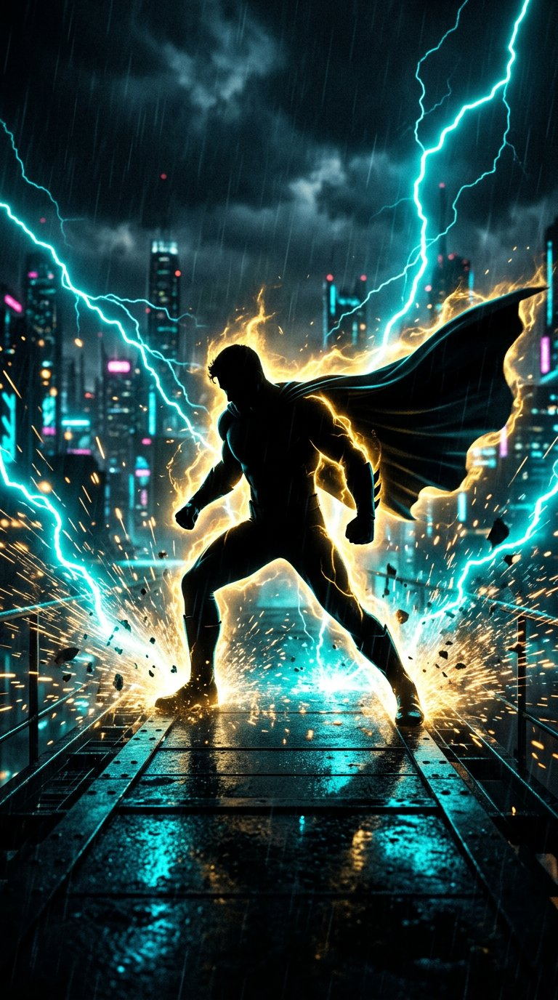

# 🔥 Photorealistic Live-Camera Palm Fire AR

> A real-time computer-vision and WebGL shader system that simulates physical fire burning authentically from a single human palm in a live camera feed.



## 🌟 Core Architecture & Capabilities

### 1. Single-Hand 3D Landmark Tracking (`numHands = 1`)
- **MediaPipe 3D Hand Landmarker**: Tracks 21 anatomical landmarks in real-time $(x, y, z)$.
- **Anatomical Palm Anchor**: Computes the true palm hollow center from the wrist ($L_0$) and MCP knuckles ($L_5, L_9, L_{13}, L_{17}$).
- **3D Palm Normal & Angle**: Calculates the 3D surface normal vector $\vec{N}$ and 2D orientation angle $\theta$ to orient the flame with palm tilt, rotation, and camera-facing angle.
- **Adaptive 1-Euro Filter**: Dual-pole adaptive filtering eliminates high-frequency jitter when holding the hand steady while providing zero perceptible latency during rapid sweeps.
- **Motion & Momentum Modeling**: Computes hand velocity $\vec{V}$ and acceleration $\vec{a}$, imparting realistic inertia and aerodynamic drag to the flame and embers.

### 2. Photorealistic Combustion & Flame Shader (WebGL)
- **Multi-Octave Simplex & Curl Noise Advection**: Simulates turbulent Taylor-Green vortices and Kelvin-Helmholtz instabilities. Flame tongues organically lick, curl, split, and merge.
- **Blackbody Radiation & Combustion Color Spectrum**:
  - **Incandescent White-Hot Core** ($T > 0.85$) with intense HDR highlights.
  - **Golden/Lemon Yellow Mid-Body** ($0.60 < T \le 0.85$).
  - **Vivid Fire Orange Combustion Mantle** ($0.35 < T \le 0.60$).
  - **Deep Crimson / Ruby Boundary** ($0.10 < T \le 0.35$).
  - **Cooling Carbon Soot** ($0.02 < T \le 0.10$).
  - **Blue Radical Ignition Rim** ($C_2$ / $CH$ combustion emission right at the palm interface).

### 3. Dynamic Hand Illumination & Heat Haze
- **Point-Light Hand Illumination**: Real-time inverse-square lighting ($1 / (1 + \alpha d + \beta d^2)$) modulated with high-frequency natural flame flicker (19Hz, 31Hz, 47Hz) casting warm orange light onto the user's real palm and fingers.
- **Heat Haze Refraction**: Screen-space optical distortion shader perturbing video texture coordinates above the flame base to simulate hot rising thermal convection.

### 4. Depth-Aware 3D Hand/Finger Occlusion
- Uses 3D landmark depth values $(z)$. When fingers curl forward or move in front of the palm flame ($z_{finger} < z_{palm}$), real camera pixels of the illuminated fingers occlude the flame behind them, with subtle edge glow bleeding around finger silhouettes.

### 5. Physical Embers & Smoke
- **Incandescent Embers**: Micro-particles with thermal updraft, air drag, curl noise turbulence, and temperature cooling curve.
- **Subtle Smoke Plume**: Soft translucent soot billows rising and diffusing above flame tips.

### 6. Procedural Real-time Audio
- Web Audio API Brown Noise combustion generator with resonant bandpass filter and Poisson-distributed crackle impulses.

---

## 🚀 Running Locally

```bash
# Start server
node server.js
```

Open `http://localhost:3000` in your web browser, allow camera access, and click **IGNITE FIRE** (or press **Spacebar**).
